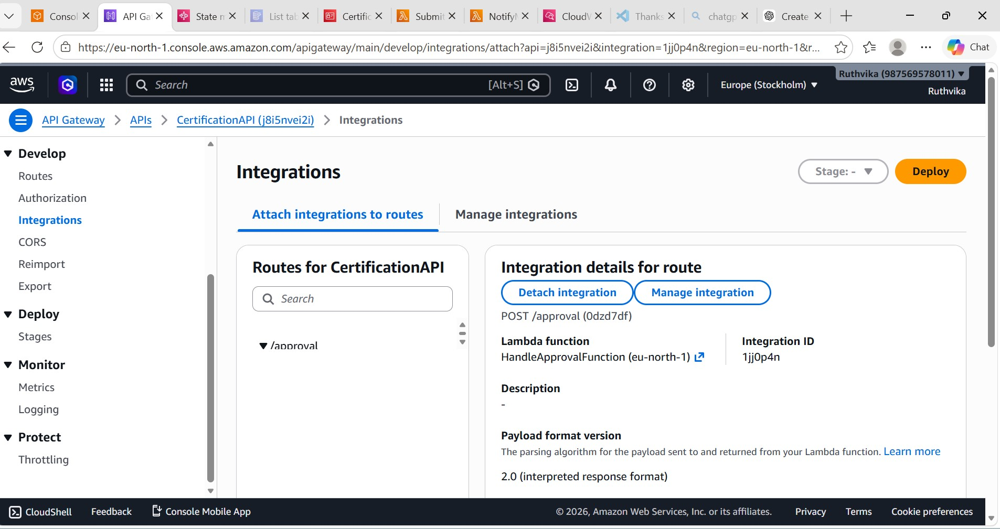
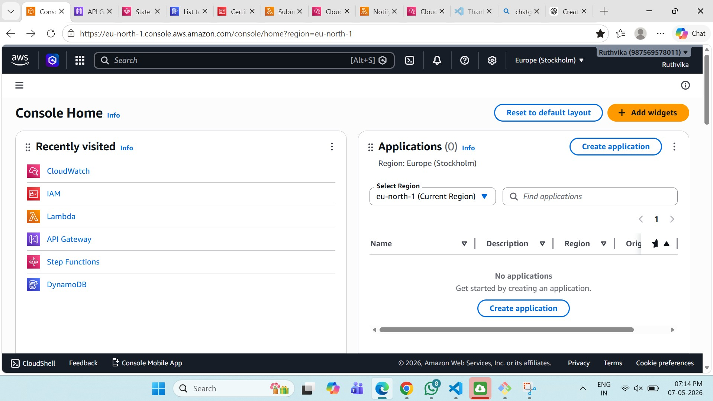
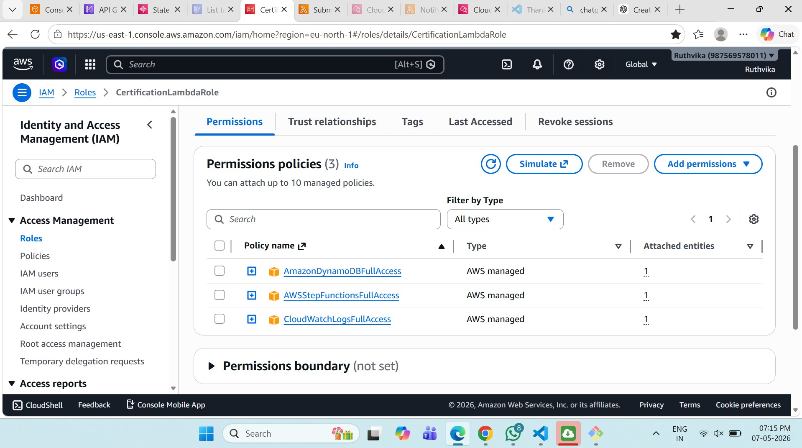
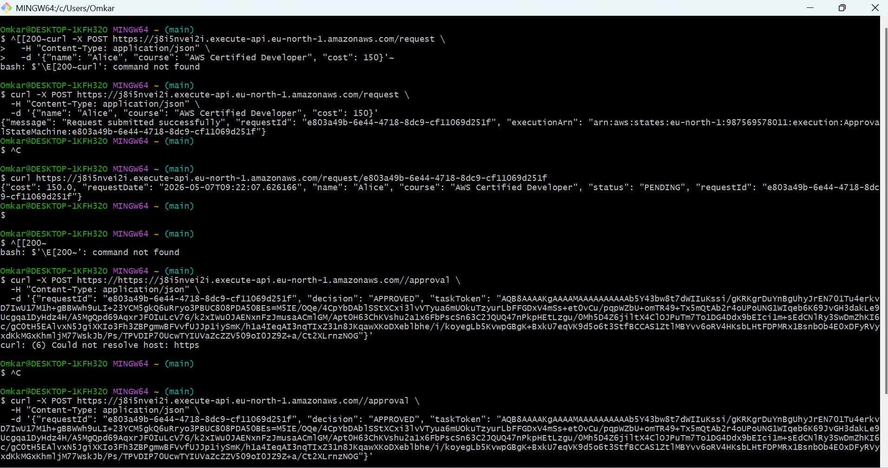
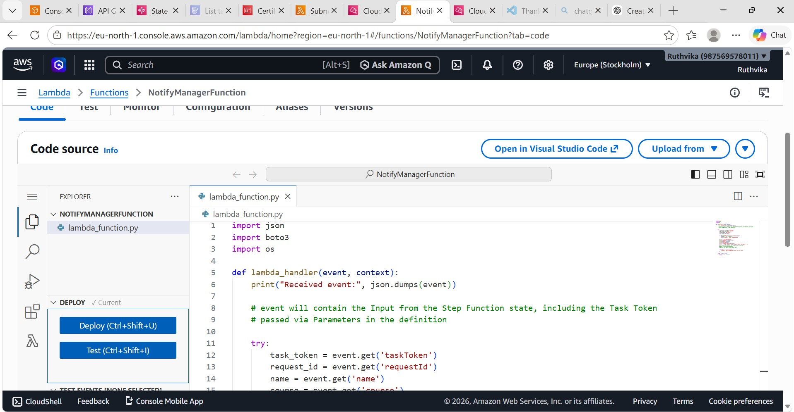
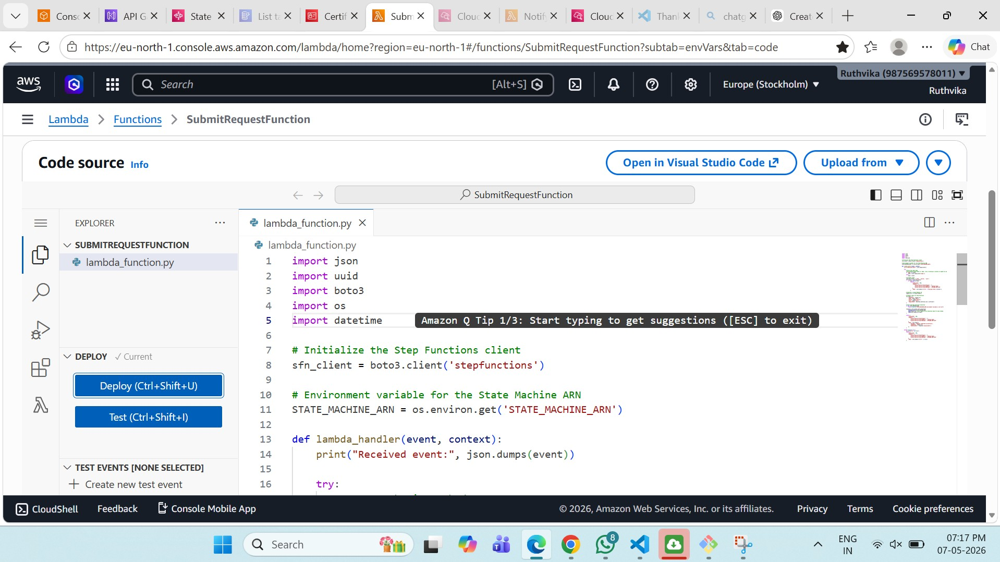

# serverless-certification-approval-system
Event-driven Serverless Certification Approval System on AWS demonstrating Lambda, API Gateway, Step Functions, DynamoDB, SNS, and CloudWatch monitoring.

# Serverless Certification Approval System (AWS)

## Project Overview
Designed and implemented an end-to-end Serverless Certification Approval System using AWS services to automate approval workflows.

## Architecture
User Request → API Gateway → Lambda → Step Functions → SNS Notification → Approval Process

## AWS Services Used
- AWS Lambda
- API Gateway
- Step Functions
- DynamoDB
- SNS
- IAM
- CloudWatch

## Key Features
✅ Fully serverless architecture  
✅ Automated approval workflow  
✅ Event-driven processing  
✅ Secure IAM role-based access  
✅ Real-time notifications

## My Responsibilities
- Designed serverless architecture
- Developed Lambda functions (Python)
- Built workflow using Step Functions
- Implemented approval logic
- Monitoring using CloudWatch

## Skills Demonstrated
AWS | Serverless | Lambda | Step Functions | Automation | Cloud Architecture

# AWS Project Screenshots 

# API Gateway

---

# AWS Console

---

# Certification Lambda Function

---

# Git Bash Deployment

---

# Notify Manager Function

---

# Submit Request Function

## Author
Ruthvika Salgare
